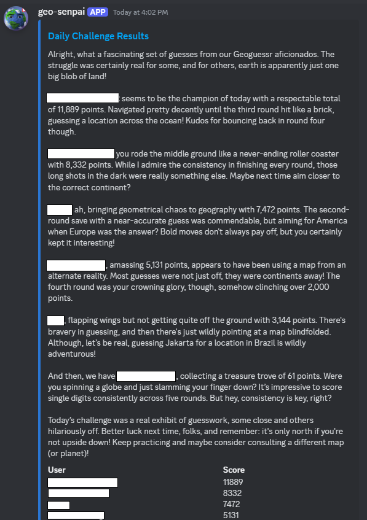

# GeoGuessr Daily Challenge Bot
Each day, this bot posts a daily Geoguessr challenge to a Discord channel and gathers results from the previous day. It uses GPT4 to generate an analysis of the previous day's results and isn't afraid to trash talk people who don't perform well.

The script gets deployed as a [Modal](https://modal.com) cron job. **No manual server setup outside this repo is required.**



## Prerequisites

- Discord bot account (create an app with a bot at https://discord.com/developers/applications)
- GeoGuessr account with a subscription that lets you create challenges
- OpenAI account with credits to access gpt4-turbo
- Modal account (https://modal.com/)

## Installation

- Clone the repository.
    ```bash
    git clone https://github.com/ldcWV/daily-geoguessr-bot.git
    ```
- Rename `config_example.py` to `config.py`.
- Add your tokens and API keys to `config.py`.
    - `NCFA_TOKEN` is your Geoguessr login credentials. See [here](https://github.com/SafwanSipai/geo-insight?tab=readme-ov-file#getting-your-_ncfa-cookie) for instructions to obtain.
    - `DISCORD_TOKEN` is the your Discord bot's token. You can create it in the Discord Developer Portal.
    - `CHANNEL_ID` is the id of the Discord channel the bot should send messages to.
    - `OPENAI_KEY` is the API key for your OpenAI account.
    - `ASSISTANT_ID` is the id of the OpenAI Chat Assistant. You can create a custom assistant [here](https://platform.openai.com/assistants). A reasonable prompt to use is this:
        > You are a Discord bot that posts daily Geoguessr challenges. At the end of each day, I will provide you a json string containing the leaderboard for that day. The leaderboard contains information about how many points each player achieved in total, the points per round, the time taken per round, and the actual vs guessed location for each player. Each time I give you the information, please provide a brief analysis of the challenge results. Make snarky comments and poke fun at people who did not perform well, and give praise to those that did perform well. Try to write something about each person on the leaderboard. Some context about Geoguessr: each game is 5 rounds, with the max points per round being 5000, and the max total points being 25000.

        Obviously, the prompt can be customized to your liking.
    - `THREAD_ID` is the id of the thread that the bot will talk in. One way to create one is using the [Playground](https://platform.openai.com/playground/assistants).
    - `MAP_ID` is the id of the Geoguessr map to use. By default, this uses "A Community World".

## Usage

```bash
modal deploy --name geoguessr_bot ./run.py
```

Note: you will need to create and connect your Modal account for this to work.

## Contributing

Pull requests are welcome. For major changes, please open an issue first to discuss what you would like to change.

## License

This project is licensed under the [MIT License](https://opensource.org/licenses/MIT).

## Acknowledgements

- I used [this repo](https://github.com/sh-mug/daily-geoguessr-bot) as a starting point.
- Thanks to everyone in Bing Bong's Bedroom for helping with testing!
