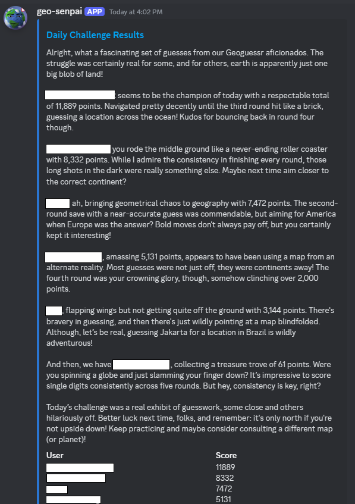

# GeoGuessr Daily Challenge Bot

This bot generates a GeoGuessr challenge at a regular time each day and posts it to a specified Discord channel. Additionally, it also posts the previous day's challenge ranking to the same channel.
By default, the challenge has ACW, 1 minute, and no move settings, but these can be customized as needed.



## Requirements

- Node.js
- Discord account
- GeoGuessr account
- Chromium browser (for running Puppeteer)

## Installation

1. Clone the repository

```bash
git clone https://github.com/sh-mug/daily-geoguessr-bot.git
```

2. Install the dependencies

```bash
npm install
```

3. Rename `.env.example` to `.env`

```bash
mv .env.example .env
```

4. Edit `.env` and set the required environment variables

## Usage

```bash
npm start
```

## Environment Variables

- `EMAIL` - GeoGuessr account email
- `PASSWORD` - GeoGuessr account password
- `DISCORD_TOKEN` - Discord bot token
- `CHANNEL_ID` - ID of the Discord channel to post the daily challenge
- `LAST_CHAL_URL` - URL of the last challenge posted (optional; used to take a result screenshot)

## Contributing

Pull requests are welcome. For major changes, please open an issue first to discuss what you would like to change.

## License

This project is licensed under the [MIT License](https://opensource.org/licenses/MIT).

## Acknowledgements

- [Discord.js](https://discord.js.org/)
- [Node-cron](https://github.com/kelektiv/node-cron)
- [Puppeteer](https://github.com/puppeteer/puppeteer)
- [Sharp](https://github.com/lovell/sharp)
