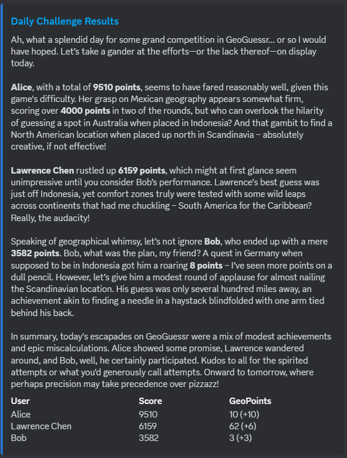
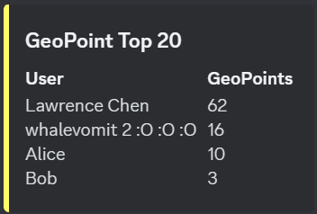

# GeoGuessr Daily Challenge Bot
This is a Discord bot that posts daily GeoGuessr challenges. At the end of each day, it automatically retrieves the results and posts them to the channel, along with an analysis by ChatGPT. In addition, it rewards players with "GeoPoints" which are accumulated over time and displayed on a leaderboard.

Upon running a single command, the script gets deployed automatically as a [Modal](https://modal.com) cron job. **No manual server setup outside this repo is required.**





## Prerequisites

- Discord bot account (create an app and add a bot to it [here](https://discord.com/developers/applications))
- GeoGuessr account with a subscription that lets you create challenges
- OpenAI account with credits to run gpt-4-turbo
- [Modal](https://modal.com/) account

## Installation

- Clone the repository.
    ```bash
    git clone https://github.com/ldcWV/daily-geoguessr-bot.git
    ```
- [Install Modal and connect your account.](https://modal.com/docs/guide)

- Rename `config_example.py` to `config.py`.

- Add tokens and API keys to `config.py`.
    - `NCFA_TOKEN` is your Geoguessr login credentials. See [here](https://github.com/SafwanSipai/geo-insight?tab=readme-ov-file#getting-your-_ncfa-cookie) for instructions to obtain.
    - `DISCORD_TOKEN` is your Discord bot's token. You can create it in the Discord Developer Portal.
    - `CHANNEL_ID` is the id of the Discord channel the bot should send messages to.
    - `OPENAI_KEY` is the API key for your OpenAI account.

- \[Optional\] Adjust the chat prompt and GeoGuessr map to your liking.
    - `PROMPT` is the prompt given to ChatGPT.
    - `MAP_ID` is the id of the Geoguessr map to use. By default, this uses [A Community World](https://www.geoguessr.com/maps/62a44b22040f04bd36e8a914).

## Usage

- To run once:
    ```bash
    modal run ./run.py::run
    ```
- To deploy (runs every day at 9pm EST):
    ```bash
    modal deploy --name geoguessr_bot ./run.py
    ```

## Contributing

Pull requests are welcome. For major changes, please open an issue first to discuss what you would like to change.

## License

This project is licensed under the [MIT License](https://opensource.org/licenses/MIT).

## Acknowledgements

- I used [sh-mug's repo](https://github.com/sh-mug/daily-geoguessr-bot) as a starting point.
- Thanks to everyone in Bing Bong's Bedroom for testing!
